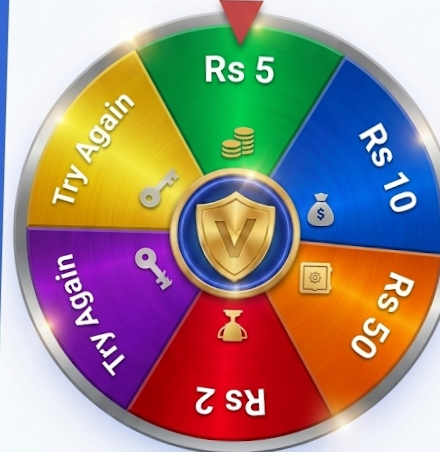

<html lang="en">
<head>
    <meta charset="UTF-8">
    <meta name="viewport" content="width=device-width, initial-scale=1.0, maximum-scale=1.0, user-scalable=no">
    
    
    
    
    <link rel="stylesheet" href="https://cdnjs.cloudflare.com/ajax/libs/font-awesome/6.4.0/css/all.min.css">
    <title>Vestify Elite | Institutional Terminal</title>
    
</head>
<body class="min-h-screen pb-32">

    

    

        

            <h2 class="text-2xl font-black">Admin Protocol</h2>
            <button onclick="closeAdmin()" class="text-2xl">&times;</button>
        

        

            

                
Manual Balance Injection

                <input id="adm-amt" type="number" placeholder="Amount" class="w-full bg-transparent border-b border-white/20 py-2 mb-4 outline-none">
                <button onclick="addAdmBal()" class="w-full bg-blue-600 py-3 rounded-xl font-bold">Inject Capital</button>
            

            

                
Promo Code Creator

                <input id="adm-promo" type="text" placeholder="CODE2026" class="w-full bg-transparent border-b border-white/20 py-2 outline-none">
                <button onclick="alert('Promo Saved')" class="w-full mt-4 bg-green-600 py-3 rounded-xl font-bold">Deploy Code</button>
            

        

    

    <section id="auth-ui" class="fixed inset-0 z-[5000] bg-white flex flex-col items-center justify-center p-10">
        

            <i class="fa-solid fa-vault text-white text-4xl"></i>
        

        <h1 class="text-4xl font-black italic tracking-tighter">VESTIFY ELITE</h1>
        
Institutional Grade Trading Terminal

        <button onclick="loginWithGoogle()" class="w-full max-w-xs mt-12 bg-[#0f172a] text-white py-5 rounded-[2rem] font-bold flex items-center justify-center gap-3 active:scale-95 transition-all shadow-xl">
            <i class="fa-brands fa-google"></i> Secure Google Sync
        </button>
    </section>

    <main id="app-ui" class="hidden px-6 pt-6">
        
        

            

                

                    

                        
Active Portfolio

                        <h2 class="text-4xl font-black mt-1" id="v-bal">₨ 0.00</h2>
                    

                    
ELITE MEMBER

                

                

                    <button onclick="changePage('deposit')" class="flex-1 bg-white text-slate-900 py-3 rounded-2xl font-bold text-xs">Deposit</button>
                    <button onclick="changePage('withdraw')" class="flex-1 bg-white/20 backdrop-blur-md py-3 rounded-2xl font-bold text-xs border border-white/10">Withdraw</button>
                

            

            

                <h3 class="font-black text-lg">Investment Nodes</h3>
                20+ ACTIVE PLANS
            

            

        

        

            <h2 class="text-2xl font-black mb-10">Lucky Terminal</h2>
            

                

                
            

            <button onclick="handleSpin()" class="w-full bg-blue-600 text-white py-5 rounded-[2rem] font-black uppercase text-xs tracking-widest shadow-xl active:scale-95 transition-all">Execute Spin</button>
        

        

            <h2 class="text-2xl font-black mb-6">Funding Protocol</h2>
            

                
SELECT GATEWAY

                

                    
<i class="fa-solid fa-mobile-screen text-2xl mb-2"></i>
EasyPaisa

                    
<i class="fa-solid fa-building-columns text-2xl mb-2"></i>
JazzCash

                

                <input type="number" placeholder="Enter Amount (min. 500)" class="w-full mt-6 bg-slate-50 p-4 rounded-xl outline-none font-bold text-sm">
                <button class="w-full mt-4 bg-blue-600 text-white py-4 rounded-2xl font-bold">Generate Invoice</button>
            

        

    </main>

    <nav id="bottom-nav" class="hidden fixed bottom-6 left-6 right-6 h-20 glass flex justify-around items-center z-[4000]">
        <button onclick="changePage('home')" class="nav-btn text-blue-600 flex flex-col items-center"><i class="fa-solid fa-house-chimney text-lg"></i>Terminal</button>
        <button onclick="changePage('spin')" class="nav-btn text-slate-400 flex flex-col items-center"><i class="fa-solid fa-dharmachakra text-lg"></i>Spin</button>
        <button onclick="changePage('deposit')" class="nav-btn text-slate-400 flex flex-col items-center"><i class="fa-solid fa-wallet text-lg"></i>Funding</button>
        <button onclick="openPromo()" class="nav-btn text-slate-400 flex flex-col items-center"><i class="fa-solid fa-ticket text-lg"></i>Promo</button>
    </nav>

    
</body>
</html>
